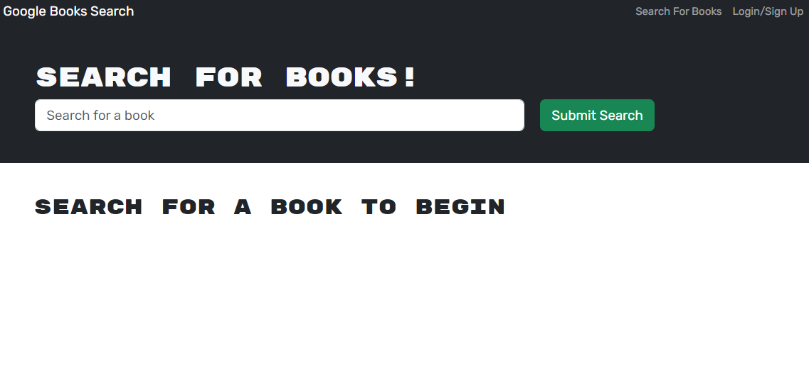

# Book Search Engine
Refactor of a Google Books API search engine into a GraphQL API using Apollo Server. Built with MERN Stack (MongoDB, Express.js, React, Node.js). Allows users to search for books, view details, and save favorite books. Features authentication and book saving capabilities.

   
    

# Render link

# Technologies Used

JavaScript 
Handlebars.js 
Express.js 
Sequelize 
PostgreSQL 
Render 
GitHub

# Installation
nom install 
npm run develop